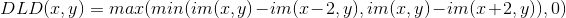

# Lane detection for Unipr Course in Computer Vision for Vehicle
Lane detection with a classical and with a deep learning based approach for Computer Vision for Vehicle course. Contains a simple lane detection algorithm and inference in C++/libtorch for a pretrained [ERFNet](https://ieeexplore.ieee.org/document/8063438) on TuSimple with [Hsu clustering loss](https://arxiv.org/abs/1803.06459).

## Tasks for Ex. 1

1) Load the KITTI odometry01 directory in greyscale and visualize it
2) Obtain a IPM image applying the homography matrix given
3) Process the IPM with a DLD kernel
4) Binarize the obtained image with a fixed threshold
5) Binarize the obtained image with an adaptive threshold
6) Cluster the points together. A point belongs to a cluster if it is near (NxN) to a point in that cluster.

  

